# praktika5
Чепрасова А.И.
### Лабораторная работа №1: Настройка параметров рабочей среды пользователя в ОС Windows
**Цель:** Научиться выполнять различные настройки параметров рабочей среды пользователя.

### **Методические указания и задания:**
I. Настройка рабочего стола.

1. Выберите фоновый рисунок рабочего стола
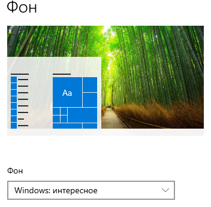
2. Измените цветовую схему.
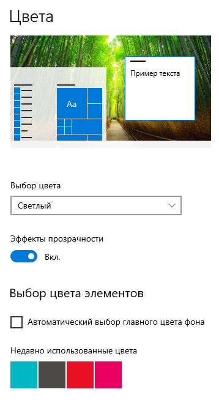
3. Настройте оформление окон Windows и их элементов.
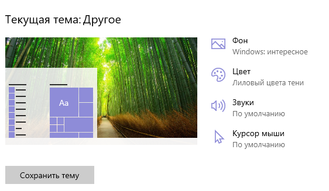
4. Подключите и настройте заставку экрана.
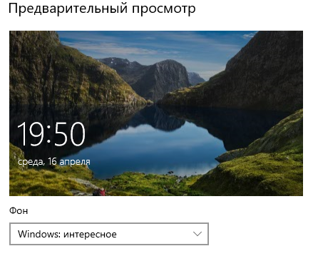
5. Сохраните пакет настроек как тему оформления Windows.

6. Определите папку сохранения темы пользователя.
``` C:\Users\[Ариша]\AppData\Local\Microsoft\Windows\Themes```


### **II. Настройка звуков**
1. Выберите фоновый рисунок рабочего стола.

2. Измените цветовую схему.
3. Сохраните новые настройки как звуковую схему.
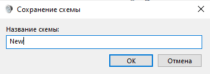
4. Определите папку сохранения звуковой схемы пользователя.

### **III. Настройка параметров мыши**
1. Установите максимальную скорость двойного щелчка на вкладке «Кнопки».
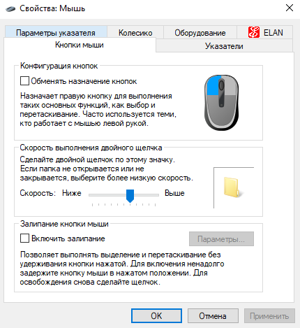
2. Выберите инверсную схему указателей, настройте виды указателей и включите тень указателя.
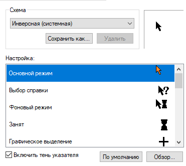
3. Сохраните настройки как схему указателей.
4. Определите папку сохранения схемы пользователя. 
``` C:\Windows\Cursors ```
5. Настройте скорость движения указателя выше среднего и отобразите след указателя мыши.
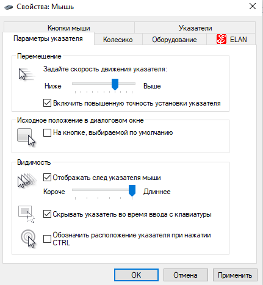
6. Установите поворот колесика мыши на один щелчок на 7 строк.
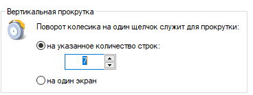

### **IV. Настройка панели задач**
1. Переместите панель задач в верхнюю часть экрана. 

2. Включите автоматическое скрытие панели задач.

3. Настройте группировку задач при заполнении панели задач.

4. Скрывайте значки уведомлений для громкости и сети.

5. Настройте отображение недавно использовавшихся программ (5 штук).
6. Закрепите программу Paint на панели задач.

7. Уберите часы с панели задач.

### **V. Настройка главного меню Windows**
1. Добавьте новый элемент в главное меню (папку с ярлыками программ).

2. Создайте элемент «Мои программы» с ярлыками для запуска калькулятора и блокнота.

### **VI. Настройка элементов автозагрузки**
1. Разместите ярлыки для запуска MS Word и MS Excel в папке автозагрузки.

### **VII. Настройка клавиатуры**
1. Закройте языковую панель на панели задач.
2. Верните языковую панель обратно через настройки панели управления.
3. Установите сочетание клавиш Ctrl+Shift для смены раскладки клавиатуры.

### **VIII. Настройка свойств папок**
1. Выберите вариант обзора папок (открывать каждую папку в отдельном окне). 

2. Установите параметры отображения (например, показывать расширения файлов).

3. Измените значок для любой папки.

### **IX. Выбор программ по умолчанию**
1. Назначьте MS Word программой по умолчанию для текстовых файлов (.txt).
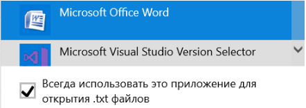
## Лабораторная работа №2: Работа в режиме командной строки
**Цель:** Изучить основы работы в командной строке, освоить команды для работы с файлами и каталогами.

**Задания:**
1. Оформить отчет с результатами выполнения заданий (скриншоты).
2. Составьте конспект используемых команд с пояснениями. 3–39: Выполните практические задания с использованием команд (например, создание каталогов, копирование/перемещение файлов, настройка атрибутов).


# Конспект основных команд CMD

## Управление файлами и каталогами

### Навигация
| Команда | Описание | Пример |
|---------|----------|--------|
| `CD` | Смена текущего каталога | `CD C:\Folder` |
| `CD..` | Переход в родительский каталог | `CD..` |
| `CD\` | Переход в корневой каталог | `CD\` |

### Работа с каталогами
| Команда | Описание | Пример |
|---------|----------|--------|
| `DIR` | Просмотр содержимого каталога | `DIR /A` |
| `MD` | Создание каталога | `MD NewFolder` |
| `RD` | Удаление каталога | `RD OldFolder` |
| `TREE` | Отображение структуры каталогов | `TREE /F` |

### Работа с файлами
| Команда | Описание | Пример |
|---------|----------|--------|
| `COPY` | Копирование файлов | `COPY file.txt C:\Backup\` |
| `XCOPY` | Расширенное копирование | `XCOPY /S /E source dest` |
| `MOVE` | Перемещение файлов | `MOVE file.txt C:\New\` |
| `REN` | Переименование файлов | `REN old.txt new.txt` |
| `DEL` | Удаление файлов | `DEL file.txt` |
| `TYPE` | Просмотр содержимого файла | `TYPE file.txt` |

### Атрибуты файлов
| Команда | Описание | Пример |
|---------|----------|--------|
| `ATTRIB` | Изменение атрибутов | `ATTRIB +H +S file.txt` |
| Флаги: | | |
| `+H` | Скрытый файл | |
| `+R` | Только для чтения | |
| `+S` | Системный файл | |
| `+A` | Архивный файл | |

## Системные команды

| Команда | Описание | Пример |
|---------|----------|--------|
| `CLS` | Очистка экрана | `CLS` |
| `HELP` | Справка по командам | `HELP DIR` |
| `VER` | Версия Windows | `VER` |
| `DATE` | Текущая дата | `DATE /T` |
| `TIME` | Текущее время | `TIME /T` |

## Сетевые команды

| Команда | Описание | Пример |
|---------|----------|--------|
| `PING` | Проверка соединения | `PING google.com` |
| `IPCONFIG` | Сетевые настройки | `IPCONFIG /ALL` |
| `TRACERT` | Трассировка маршрута | `TRACERT google.com` |

## Полезные сочетания
- `TAB` - автодополнение имен файлов
- `↑/↓` - перебор предыдущих команд
- `> file.txt` - перенаправление вывода в файл
- `Ctrl+C` - прерывание выполнения команды
### Контрольные вопросы:

1–5: Ответьте на вопросы об этапах установки ОС, выборе параметров BIOS/UEFI и типах лицензий Windows.

# Установка Windows: BIOS/UEFI и лицензии

## 1. Этапы установки

### Подготовка
1. Создать загрузочную флешку (Media Creation Tool/Rufus)
2. Настроить BIOS/UEFI:
   - Режим загрузки: **UEFI** (для Win10/11)
   - Secure Boot: **Enabled** (для Win11)
   - Boot Order: USB → SSD/HDD

### Установка
1. Разметка диска:
   - Системный раздел: 100-500 МБ (UEFI)
   - Основной раздел: NTFS
2. Пропустить ввод ключа (активировать позже)
3. Создать пользователя

## 2. Критичные настройки BIOS/UEFI
| Параметр       | Рекомендация          |
|----------------|-----------------------|
| Boot Mode      | UEFI                  |
| Secure Boot    | Enabled (Win11)       |
| TPM            | Enabled (Win11)       |
| AHCI Mode      | Для SSD               |

## 3. Типы лицензий
- **Retail**: для розницы (переносимая)
- **OEM**: для производителей (привязана к железу)
- **Volume**: корпоративная (KMS)

## 4. Частые проблемы
1. "Windows cannot be installed":
   - Сменить режим диска: RAID → AHCI
   - Пересоздать разделы
2. Не видит флешку:
   - Проверить формат: FAT32 для UEFI
   ## Лабораторная работа №4: Работа с виртуальными машинами

**Цель:** Освоить навыки работы с виртуальными машинами (VirtualBox или VMware).

### Методические указания:

1–8: Установите виртуальную машину, настройте параметры оборудования, установите ОС внутри виртуальной машины и проверьте её работоспособность.
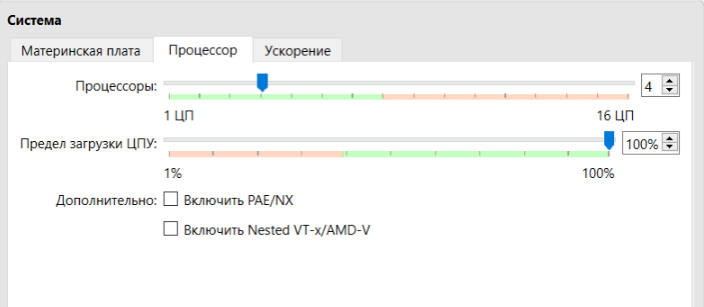
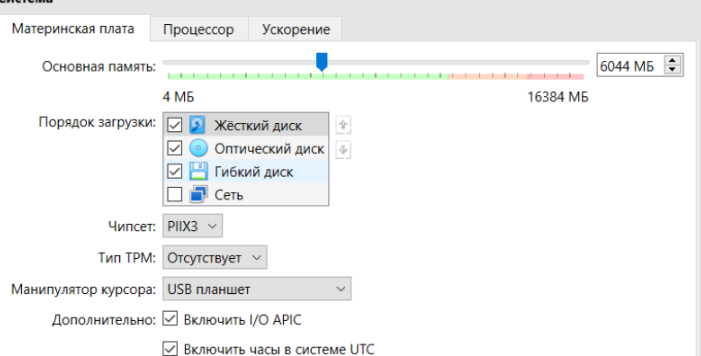
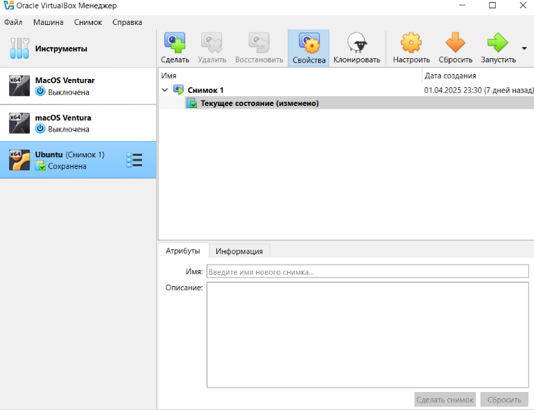
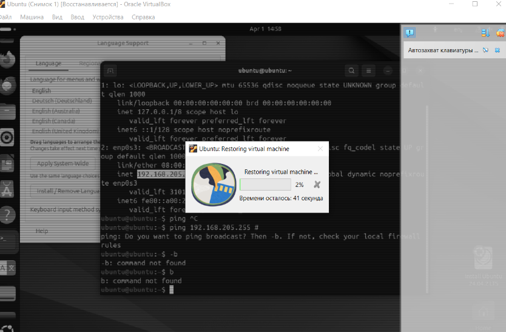
### Контрольные вопросы:

1–5: Ответьте на вопросы о преимуществах виртуализации, отличиях гипервизоров первого и второго типа и способах настройки сети для виртуальных машин.

# Виртуализация: преимущества, гипервизоры и сети

## 1. Преимущества виртуализации
- **Экономия ресурсов**: Запуск нескольких ВМ на одном физическом сервере
- **Изоляция**: Сбои в одной ВМ не влияют на другие
- **Тестирование**: Безопасная среда для экспериментов
- **Миграция**: Перенос ВМ между хостами без простоя
- **Резервирование**: Снимки (snapshots) состояния ВМ

## 2. Типы гипервизоров

### Type 1 (Аппаратные)
- Работают напрямую на железе (без ОС)
- Примеры: VMware ESXi, Microsoft Hyper-V, Xen, KVM
- **Плюсы**: 
  - Высокая производительность
  - Лучшая безопасность
- **Минусы**: 
  - Требуют выделенного сервера

### Type 2 (Программные)
- Работают поверх ОС хоста
- Примеры: VirtualBox, VMware Workstation, Parallels
- **Плюсы**:
  - Простота использования
  - Не требуют спецоборудования
- **Минусы**:
  - Низкая производительность
  - Ограниченные возможности

## 3. Настройка сетей для ВМ

| Режим          | Описание                          | Использование                  |
|----------------|-----------------------------------|--------------------------------|
| **NAT**        | ВМ используют NAT хоста          | Доступ в интернет              |
| **Host-only**  | Изолированная сеть между ВМ и хостом | Тестирование без доступа наружу |
| **Bridge**     | ВМ получают IP из физической сети | Публичные сервисы              |
| **Internal**   | Сеть только между ВМ              | Закрытые кластеры              |

### Пример для VirtualBox:
```bash
VBoxManage modifyvm "VM_name" --nic1 bridged --bridgeadapter1 eth0
VBoxManage modifyvm "VM_name" --nic2 nat
```